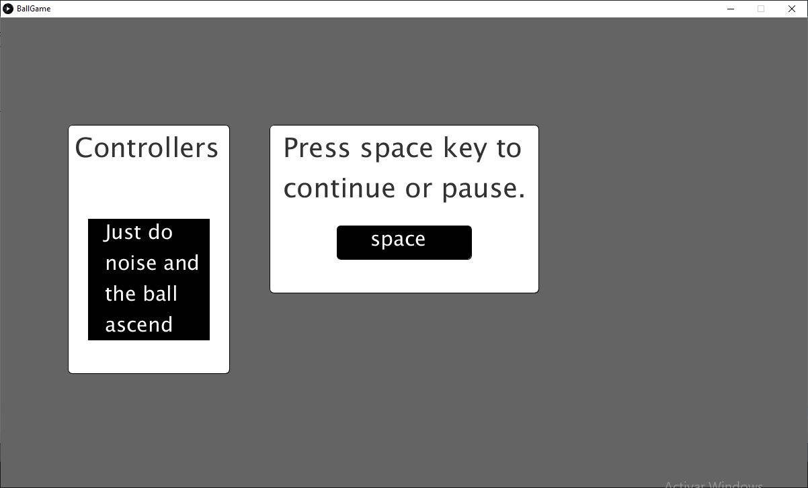
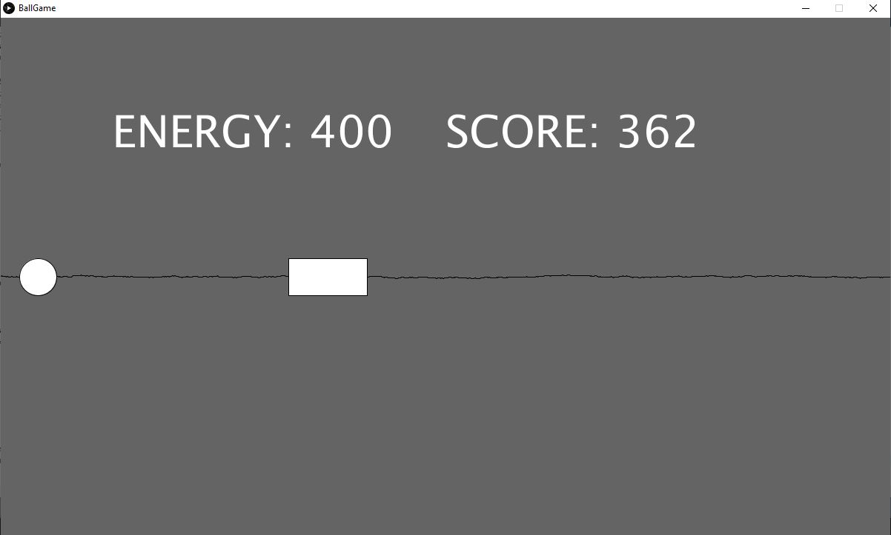
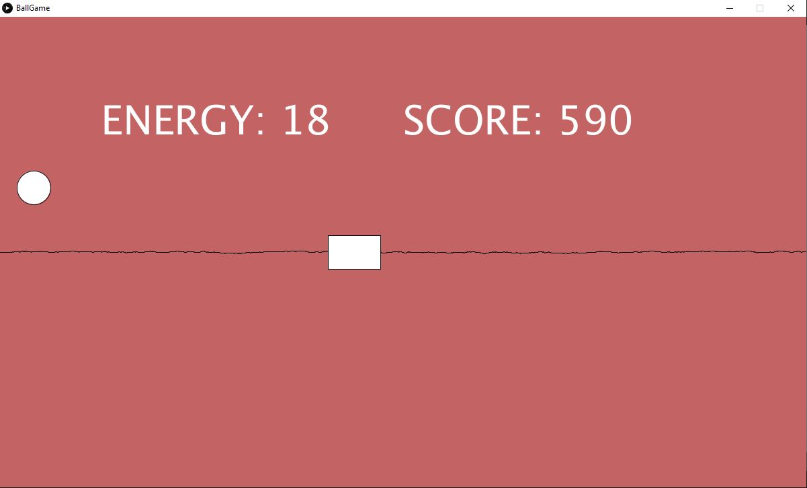
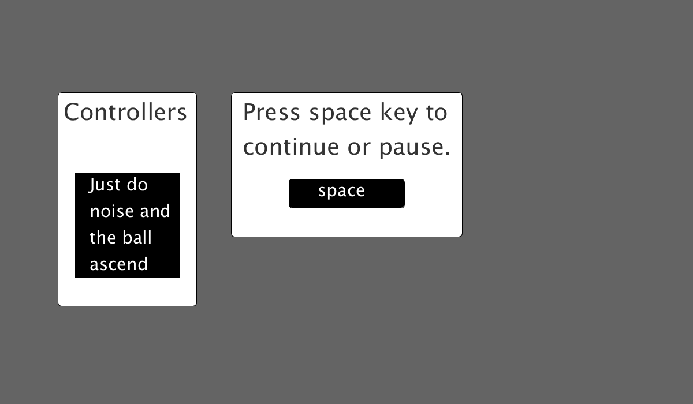

# BallGame
Juego de evitar obstáculos.
<!-- PROJECT LOGO -->
 

  <h3 align="center">Juego de evitar obstáculos</h3>

  

    ¡Haz ruido para evita que la pelota choque!
     
      <a href="https://github.com/carlosepb/BallGame"><strong>Explorar repositorio»</strong></a>
     
     
      <a href="https://github.com/carlosepb/BallGame/blob/main/images/animation.gif">Ver Demo</a>
      ·
      <a href="https://github.com/carlosepb/BallGame/issues">Reportar Error</a>
      ·
      <a href="https://github.com/carlosepb/BallGame/issues">Solicitar Colaboración</a>
    

  

<!-- TABLE OF CONTENTS -->

  
Tabla de Contenido

  <ol>
    <li>
      <a href="#sobre-el-proyecto">Sobre el Proyecto</a>
      <ul>
        <li><a href="#herramientas-de-desarrollo">Herramientas de Desarrollo</a></li>
      </ul>
    </li>
    <li><a href="#trabajo-realizado">Trabajo Realizado</a></li>
    <li>
      <a href="#empezando">Empezando</a>
      <ul>
        <li><a href="#prerrequisitos">Prerrequisitos</a></li>
        <li><a href="#instalación">Instalación</a></li>
        <li><a href="#ejecutar">Ejecutar</a></li>
      </ul>
    </li>
    <li><a href="#hoja-de-ruta">Hoja de Ruta</a></li>
    <li><a href="#licencia">Licencia</a></li>
    <li><a href="#contacto">Contacto</a></li>
    <li><a href="#agradecimientos">Agradecimientos</a></li>
  </ol>

<!-- ABOUT THE PROJECT -->
## Sobre el Proyecto

Aplicación desarrollada en Processing 3 que hace uso de la cámara de tu portátil para ponerte una máscara, en este caso disponemos de 3 distintas.
Para cambiar de máscara usaremos las teclas de flecha izquierda y flecha derecha.
En la imagen inferior podemos ver como la máscara seguirá el movimiento de nuestra cara aunque el nivel de luz sea bajo además de adaptarse al tamaño de nuestra cara por la cercanía a la cámara.(imagen_4.0)

 imagen_4.0

Aplicación desarrollada en Processing 3 que hace uso de la cámara de tu portátil para ponerte una máscara, en este caso disponemos de 3 distintas.
Para cambiar de máscara usaremos las teclas de flecha izquierda y flecha derecha.
En la imagen inferior podemos ver como la máscara seguirá el movimiento de nuestra cara aunque el nivel de luz sea bajo además de adaptarse al tamaño de nuestra cara por la cercanía a la cámara.(imagen_4.0)

 imagen_4.0

Aplicación desarrollada en Processing 3 que hace uso de la cámara de tu portátil para ponerte una máscara, en este caso disponemos de 3 distintas.
Para cambiar de máscara usaremos las teclas de flecha izquierda y flecha derecha.
En la imagen inferior podemos ver como la máscara seguirá el movimiento de nuestra cara aunque el nivel de luz sea bajo además de adaptarse al tamaño de nuestra cara por la cercanía a la cámara.(imagen_4.0)

 imagen_4.0

Aplicación desarrollada en Processing 3 que hace uso de la cámara de tu portátil para ponerte una máscara, en este caso disponemos de 3 distintas.
Para cambiar de máscara usaremos las teclas de flecha izquierda y flecha derecha.
En la imagen inferior podemos ver como la máscara seguirá el movimiento de nuestra cara aunque el nivel de luz sea bajo además de adaptarse al tamaño de nuestra cara por la cercanía a la cámara.(imagen_4.0)

 imagen_4.0

## Trabajo Realizado

Para la detección de la cara se ha utilizado el recurso OpenCV además de la librería video accesible desde la interfaz Processing 3. Para la actualización de la máscara actual se utiliza una tarea que se ejecuta a través de un hilo a modo de timer lo que nos permite actualizar la ruta al fichero donde guardamos la mascara en uso.

## Herramientas de Desarrollo

* [Processing3](https://processing.org/download/)

<!-- GETTING STARTED -->
## Empezando

### Prerrequisitos

* Descargar y descomprimir Processing3, lo puedes encontrar [aquí](https://processing.org/download/).

### Instalación
1. Para exportar a un archivo con formato gif animado es necesario instalar GifAnimation, lo puede encontrar [aquí](https://github.com/extrapixel/gif-animation).
2. Para utilizar la librería de MINIM de captura de sonido necesitará agregarla a su IDE, puede encontrarla [aquí](http://code.compartmental.net/tools/minim/).

### Ejecutar

1. Proyecto.
    * Descomprimir rar.
    * Ejecutar Processin3.
    * Archivo->Abrir...
2. Proyecto.
    * Descomprimir rar.
    * Ejecutar Processin3.
    * Archivo->Abrir...
 
<!-- ROADMAP -->
## Hoja de Ruta

En este momento no hay planes de mejorar la aplicación.

<!-- LICENSE -->
## Licencia

Software completamente libre para copiar o distribuir.

<!-- CONTACT -->
## Contacto

Autor: Carlos Eduardo Pacichana Bastidas

Email: carlos.eduardo.pacichana@gmail.com  carlos.pacichana101@alu.ulpgc.es

Enlace al proyecto: [https://github.com/carlosepb/FakeMask](https://github.com/carlosepb/BallGame)

<!-- ACKNOWLEDGEMENTS -->
## Agradecimientos
* [Processing](https://processing.org/)
* [Gif-animation](https://github.com/extrapixel/gif-animation)
* [Funprogramming](https://funprogramming.org/)
* [Text](https://processing.org/reference/text_.html)
* [Minim](http://code.compartmental.net/tools/minim/)
